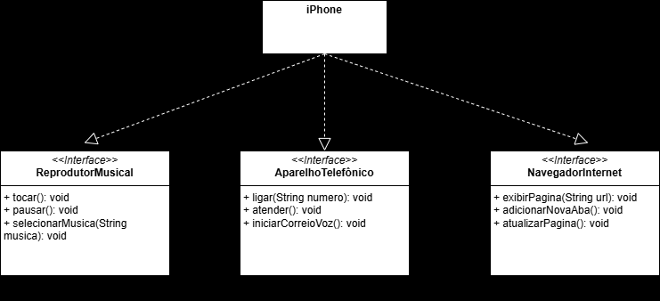

# Projeto iPhone Componentes UML - Desafio POO
Este projeto é a resolução do desafio do bootcamp DIO, na trilha Java Básico, cujas aulas são ministradas por Gleyson Sampaio. O desafio consiste em modelar e diagramar a representação UML de um componente iPhone, abrangendo suas funcionalidades como Reprodutor Musical, Aparelho Telefônico e Navegador na Internet.

## Contexto
Com base no vídeo de lançamento do iPhone de 2007, as funcionalidades do dispositivo foram diagramadas conforme as instruções. 

## Funcionalidades a modelar
1. **Reprodutor Musical**
   - Métodos: `tocar()`, `pausar()`, `selecionarMusica(String musica)`
2. **Aparelho Telefônico**
   - Métodos: `ligar(String numero)`, `atender()`, `iniciarCorreioVoz()`
3. **Navegador na Internet**
   - Métodos: `exibirPagina(String url)`, `adicionarNovaAba()`, `atualizarPagina()`

## Objetivo
Criar um diagrama UML que represente as funcionalidades descritas e implementar as classes e interfaces correspondentes em Java (opcional).

## Diagrama UML

O diagrama UML a seguir representa a modelagem das funcionalidades do iPhone.

